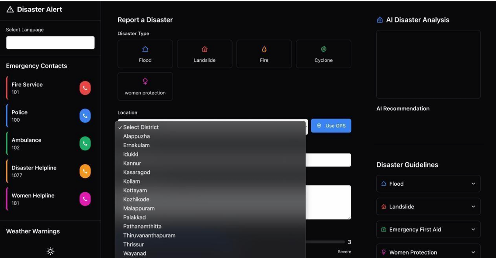
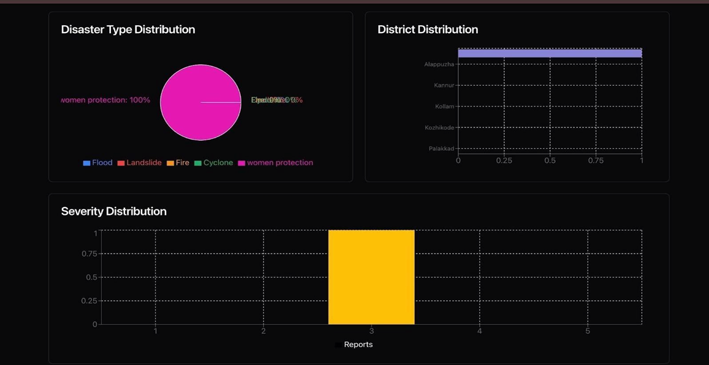
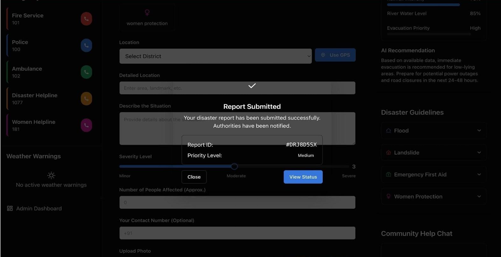

# Multilingual Disaster Reporting System

## About the Project

The **Multilingual Disaster Reporting System** is an emergency reporting web application designed to help users report disasters and emergency situations.

The system allows users to select a disaster type, provide location and situation details, select the severity level, and submit emergency reports. It also supports multilingual reporting and provides AI-assisted disaster analysis and recommendations.

## Features

* Multilingual emergency reporting
* Disaster type selection
* Automatic language detection and translation
* GPS-based location capture
* District and location selection
* Severity level selection
* Emergency description
* Photo and video reporting
* AI disaster analysis
* AI recommendations
* Emergency contacts
* Disaster guidelines
* Weather warnings
* Report submission confirmation
* Disaster statistics and dashboard

## Technologies Used

### Frontend

* React
* TypeScript

### Backend

* Python
* Flask
* Node.js

### Database

* MongoDB

## Project Workflow

```text
User
   ↓
Select Disaster Type
   ↓
Enter Location & Situation Details
   ↓
Select Severity
   ↓
Language Detection & Translation
   ↓
AI Disaster Analysis
   ↓
AI Recommendation
   ↓
Submit Emergency Report
   ↓
Report Confirmation
```

## Screenshots

### Disaster Reporting Interface

The main interface allows users to submit disaster reports by providing disaster details, selecting a district, accessing emergency contacts, and viewing AI-assisted disaster analysis.



### Disaster Statistics

The dashboard displays disaster statistics including severity distribution, district distribution, and disaster type distribution.



### Report Submission Confirmation

The system provides a confirmation notification after successfully submitting an emergency report.



## Future Improvements

* Real-time disaster alerts
* Integration with government emergency services
* Improved AI-based disaster classification
* Real-time weather and disaster data
* Mobile application support
* Voice-based emergency reporting
* Advanced disaster prediction and analytics

## Conclusion

The Multilingual Disaster Reporting System provides a centralized platform for reporting and analyzing emergency situations. By combining multilingual support, GPS-based location services, AI-assisted analysis, emergency resources, and disaster statistics, the system aims to make emergency reporting faster, more accessible, and more informative.
