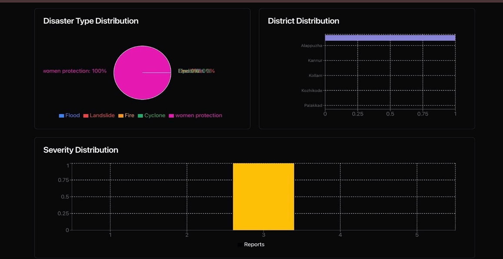

# Multilingual Disaster Reporting System

A multilingual emergency reporting web application designed to support disaster and incident reporting through location details, severity information, multilingual input, AI-assisted analysis, emergency resources, and reporting dashboards.

## Features

### Emergency Reporting
- Select disaster type
- Enter location and situation details
- Select severity level
- Capture GPS-based location
- Select district and location information
- Submit emergency reports
- Upload photos and videos

### Multilingual Support
- Detect input language
- Translate reporting content
- Support multilingual emergency communication

### AI-Assisted Analysis
- Analyze submitted disaster information
- Provide AI-assisted recommendations
- Support emergency reporting with contextual information

### Emergency Resources
- Emergency contacts
- Disaster guidelines
- Weather warnings
- Report submission confirmation

### Dashboard & Analytics
- Disaster statistics
- Severity distribution
- District distribution
- Disaster-type distribution

## Technologies

**Frontend**
- React
- TypeScript
- CSS

**Backend**
- Python
- Flask
- Node.js

**Database**
- MongoDB

## Project Workflow

```text
User
  ↓
Select Disaster Type
  ↓
Enter Location & Situation Details
  ↓
Select Severity
  ↓
Language Detection & Translation
  ↓
AI-Assisted Disaster Analysis
  ↓
AI Recommendation
  ↓
Submit Emergency Report
  ↓
Report Confirmation
  ↓
Dashboard & Statistics
```

## Screenshots

### Disaster Reporting Interface

The main interface allows users to submit disaster reports by providing disaster details, selecting a district, accessing emergency contacts, and viewing AI-assisted analysis.


### Disaster Statistics

The dashboard displays disaster statistics including severity, district, and disaster-type distributions.



### Report Submission Confirmation

The system provides confirmation after an emergency report is submitted.


> Screenshots demonstrate the application interface and functionality.

## Project Purpose

The Multilingual Disaster Reporting System demonstrates how a web application can combine **multilingual communication, location-based reporting, AI-assisted analysis, emergency resources, and data visualization** for disaster-reporting workflows.

## Future Improvements

- Real-time disaster alerts
- Integration with government emergency services
- Improved disaster classification
- Real-time weather and disaster data
- Mobile application support
- Voice-based emergency reporting
- Advanced disaster analytics

## Conclusion

The project provides a centralized interface for submitting and analyzing emergency reports while combining multilingual support, location information, AI-assisted analysis, emergency resources, and dashboard-based statistics.

## Author

**Archa Sunil**

GitHub: [archasunil1111-jpg](https://github.com/archasunil1111-jpg)
